# Nova Visualizer 🖌️ 🎨

A Visualization tool built for the **IT** Students at Philadelphia University ( Jordan ).

**You Can play with it [here](https://mohammedal-rowad.github.io/Nova-Visualizer/)**

> I was trying to understand [ D3.js](https://d3js.org), [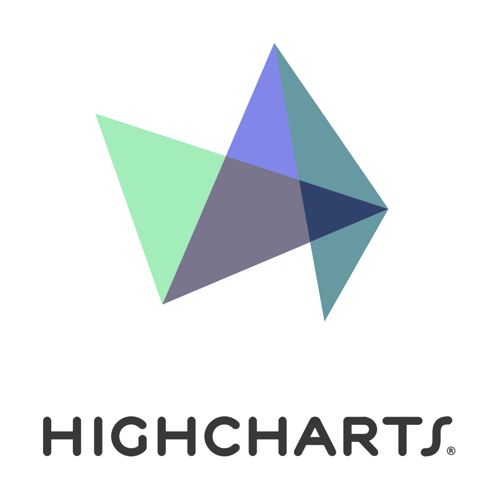 Highcharts](https://www.highcharts.com) & [IndexDB](https://developer.mozilla.org/en/docs/Web/API/IndexedDB_API).
> So I created this tool.
> with the help of [ Angular](https://angular.io/) & [Angular material](https://material.angular.io/).

- Demo Video [here](https://www.youtube.com/watch?v=9y50KR18eU4)
- _You can make your own version, just clone the dist branch_

# How to install
```console
$ https://github.com/MohammedAl-Rowad/Nova-Visualizer.git
$ cd Nova-Visualizer
$ git checkout dist # the actual code is in this branch.
$ npm i
$ ng s # for serving & developing locally, go to http://localhost:4200.com.
$ ng s --port=5402 # for changing the default port which is 4200.
$ ng b --prod # for building the project
```

# IMAGES :

- home page 1:
  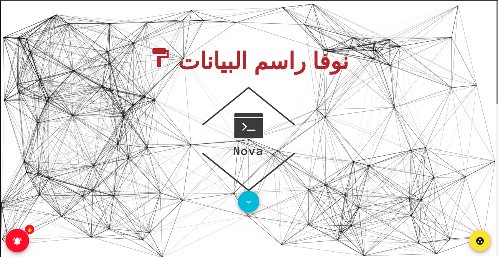

- home page 2:
  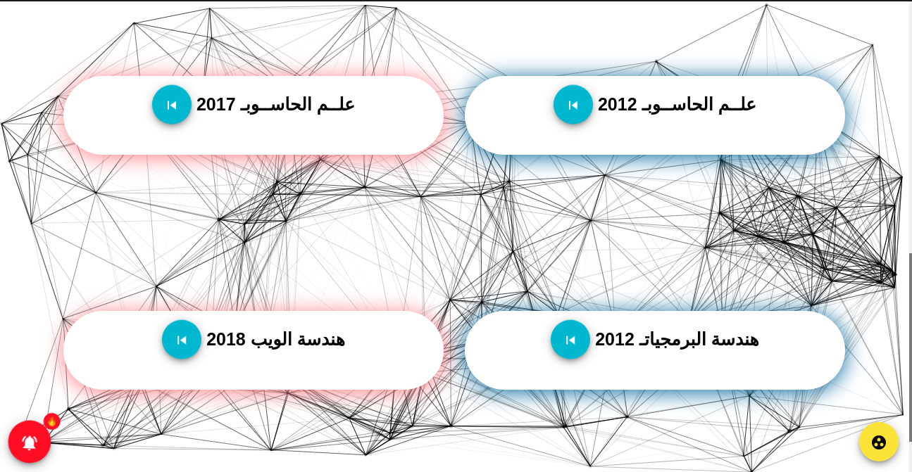

- Tree:
  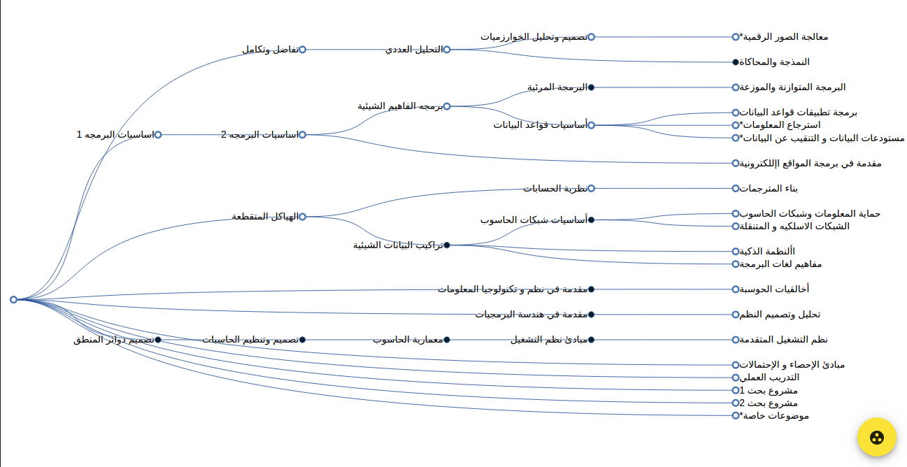

- Tree 2:
  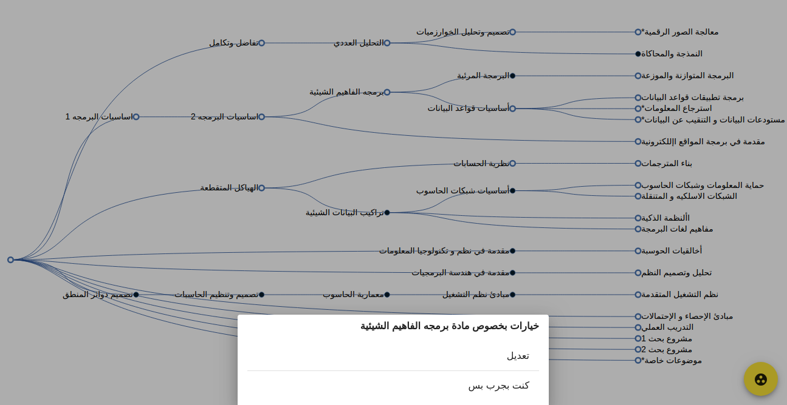

- Tree 3:
  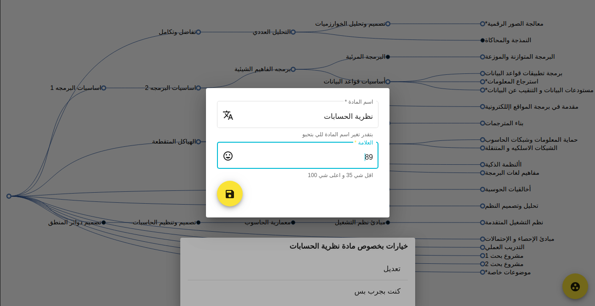

- pie 1:
  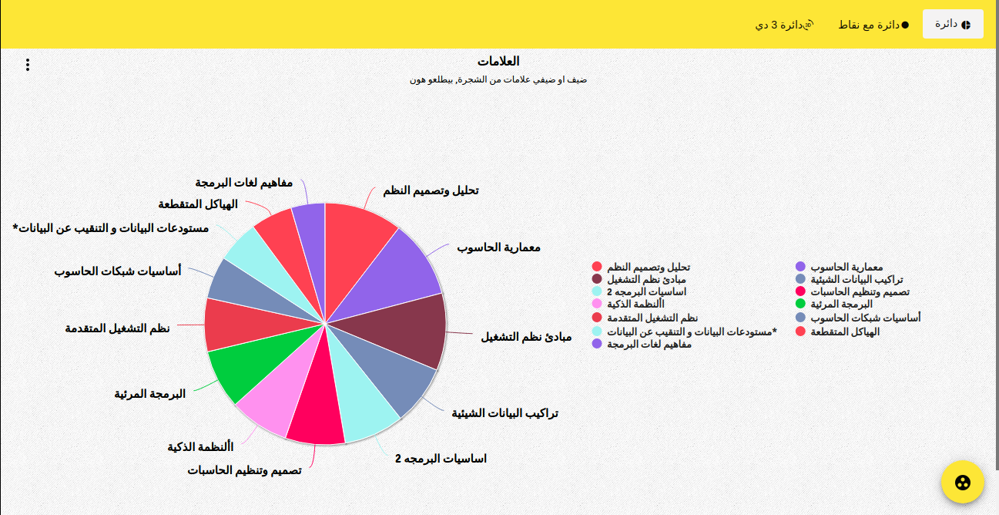

- pie 2:
  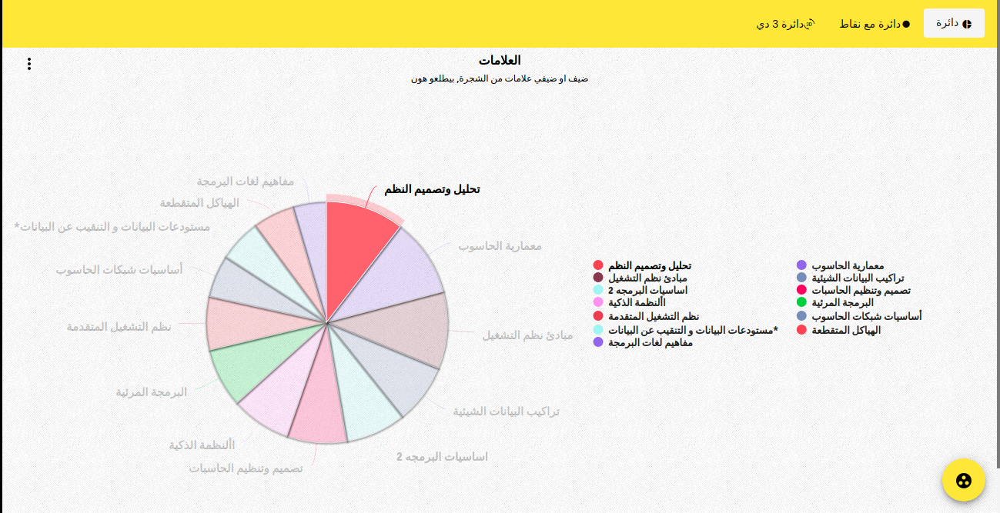

- pie 3:
  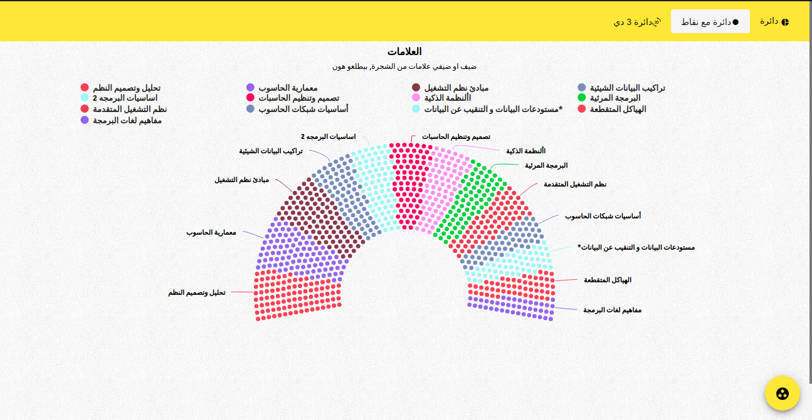

- pie 4:
  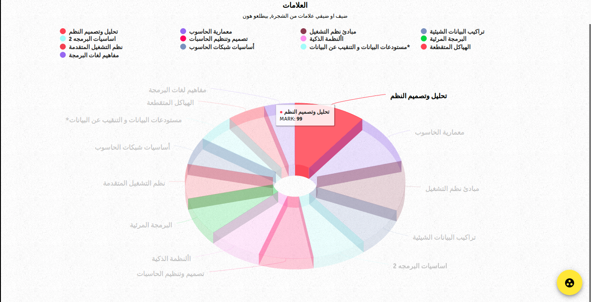

- bubbles 1:
  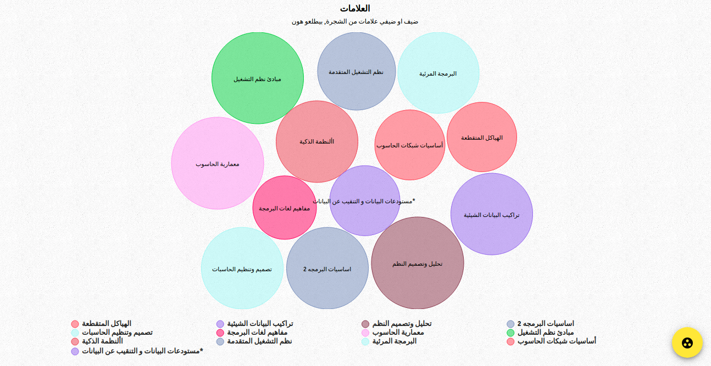

* bubbles 2:
  

* worldcloud:
  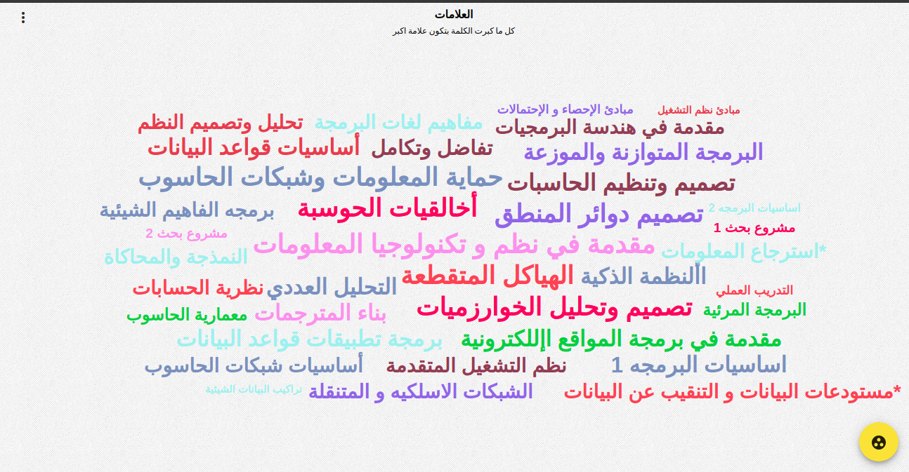

* bar 1:
  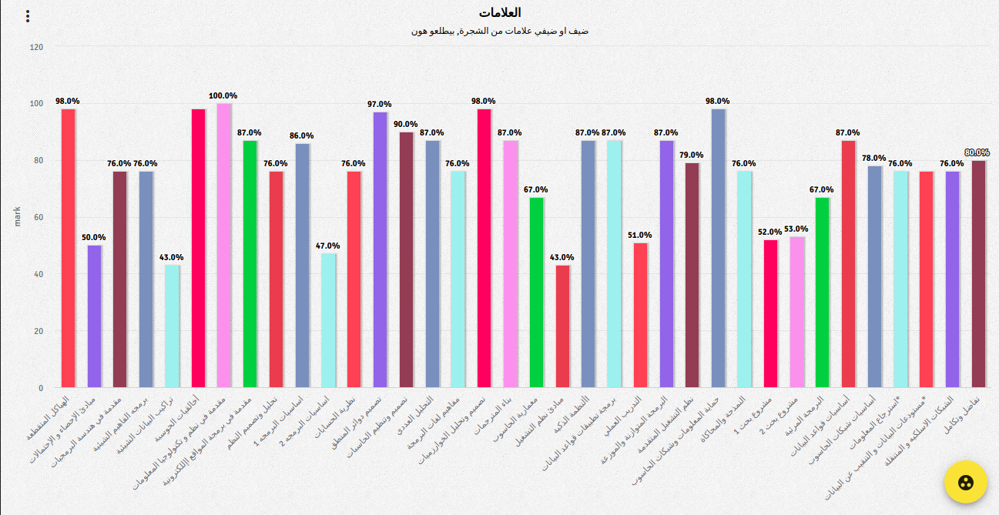

  - bar 2:
    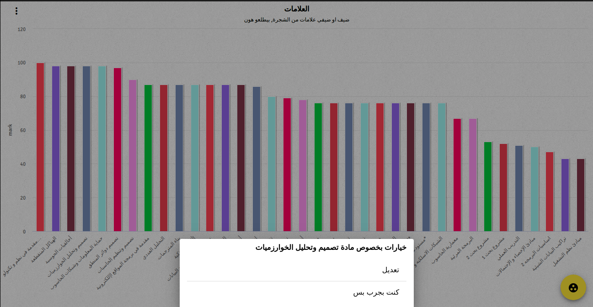

  - add free:
    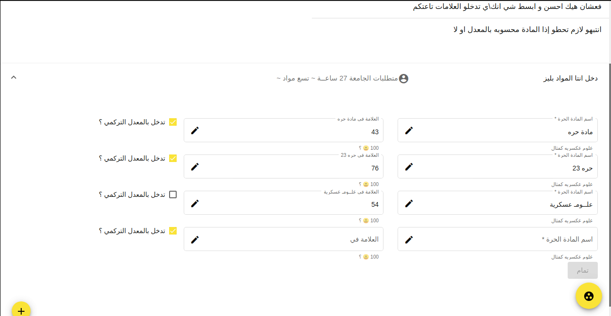

- TOTAL:
  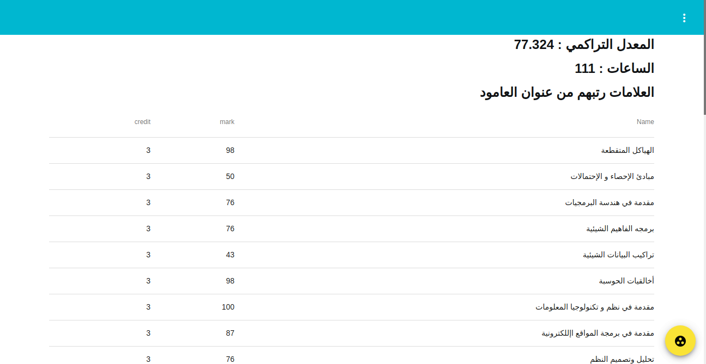
